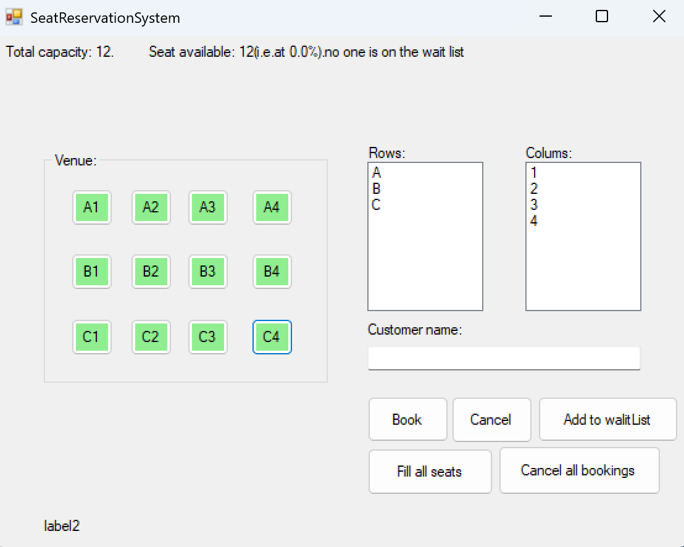

# Seat Reservation System
A basic Seat Reservation System built with C# Windows Forms App.

## User Interface

## Features

- Basic operations button: Book, Cancel, Add to waitList, Fill all seats, Cancel all bookings

## Requirements

- Windows 10 or higher
- .NET Framework 4.7.2 or higher
- Visual Studio 2019 or higher

## Installation

1. Create a new repository
2. Clone this repository and upload local code
3. Open the solution file in Visual Studio
4. Build and run the project

## Usage

1. select the column row and input the user name to the booking seat
2. click the cancel button can cancel the booking
3. Add to waitlist: all seats that have been booked can add Add to the waitlist
4. Fill all seats: let all empty seats booking
5. Cancel all bookings

## Authors

- Yanping Guo

## License

This project is licensed under the MIT License - see the [LICENSE](LICENSE) file for details.
I chose the MIT License because it is loose and suitable for open-source projects, and users can freely use and modify it

## Acknowledgments

- Created as part of Conestoga College's Programming Concepts course.
